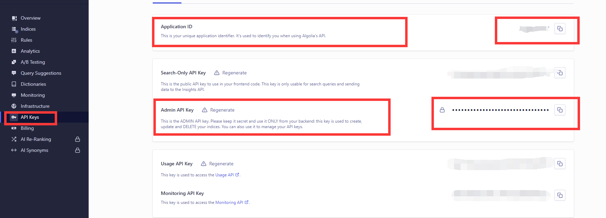

# 后台模块
> 后台核心功能讲解
# 系统管理
## 网站设置
?> 网站相关的一些基础设置,以下是相关设置在模板上的调用方式,如下网站名称的调用方式
````
<title>{{$__WEBNAME__}}<title>
````
?> 网站设置名称-调用对照表
>
名称 | 调用
---|---
网站标题 | {{$\_\_WEBNAME\_\_}}
副标题 | {{$\_\_WEBSUBTITLE\_\_}}
域名 | {{$\_\_WEBDOMIN\_\_}}
logo | {{$\_\_WEBLOGO\_\_}}
icp | {{$\_\_WEBICP\_\_}}
email | {{$\_\_WEBEMAIL\_\_}}
联系方式 | {{$\_\_WEBCONTACT\_\_}}
统计 | {!! $\_\_WEBSTATISTIC\_\_ !!}
模板名称 | {{$\_\_WEBTEMPLATE\_\_}}
## 导航设置
> 按照表单提示填入相应信息,添加导航

> 获取所有导航 qae_nav()  以下是在模板上调用轮播的方式
````
  @foreach(qae_nav() as $nav)
   <li><a href="{{$nav->href}}">{{$nav->title}}</a></li>
  @endforeach
````
## 轮播设置
> 按照表单提示填入相应信息,添加轮播

> 获取所有轮播 qae_carousel('index',10) //index为轮播位置 index=>首页 content=>内容页 // 10代表取出的数量
> 以下是在模板上调用轮播的方式
````
  @foreach(qae_carousel('index',10) as $banner)
    <a href="{{$banner->href}}" class="stui-vodlist__thumb" title="{{$banner->title}}" style="background: url({{$banner->image}}) no-repeat; background-position:50% 50%; background-size: cover; padding-top: 40%;"><span class="pic-text text-center">{{$banner->title}}</span></a>
  @endforeach
 ````
## seo设置
> seo相关设置  //关键字   //图片ALT //描述 //NOFOLLOW

名称 | 调用
---|---
关键字|{{\_\_SEOKEYWORDS\_\_}}
图片ALT|{{\_\_SEOPICALT\_\_}}
描述|{{\_\_SEODESCRIPTION\_\_}}
NOFOLLOW|{{\_\_SEONOFOLLOW\_\_}}
# 用户管理
> 按表单提示信息添加相关会员信息,可设置会员的状态 这里没啥好讲的

# 内容管理
## 分类管理
> 系统内置了部分视频分类,这些分类不可删除,删除可能会影响相关功能

> 按表单信息提示 添加你想要的分类,以下是在模板上调用分类的方式
````
//获取视频父类 qae_class_type("video")
@foreach(qae_class_type("video") as $pid)
   <li id="{{$pid->id}}">{{$pid->name}}</li>
@endforeach

//获取视频子类 qae_class_type("video",父类ID)
@foreach(qae_class_type("video",$pid->id) as $childid)
   <li id="{{$childid->id}}">{{$childid->name}}</li>
@endforeach

//获取文章父类 qae_class_type("article")
@foreach(qae_class_type("article") as $pid)
   <li id="{{$pid->id}}">{{$pid->name}}</li>
@endforeach

//获取文章子类 qae_class_type("article",父类ID)
@foreach(qae_class_type("article",$pid->id) as $childid)
   <li id="{{$childid->id}}">{{$childid->name}}</li>
@endforeach
````
## 视频管理
> 添加视频(手动添加视频),此处重点为视频播放地址内容填写格式,如下例子
````
第一集$http://www.baidu.com$m3u8

分为三个部分,三个部分之间用$符号隔开
第一部分表示:当前播放链接的标题 如第一集
第二部分表示:当前资源地址 如 http://www.baidu.com
第三部分表示:调用的播放器类型包含3种   zhilian  m3u8  mp4  如m3u8
````
> 同步图片

````
同步图片会直接同步到public/upload/image 目录下
并直接更新资源图路径

````
## 文章管理
> 添加文章 按表单提示添加即可

# 资源管理
## 采集资源
> 本系统当前默认提供 资源站 MACcms10 XML格式接口的视频采集 //其他格式暂不支持
````
请按表单提示要求 添加对应的api信息,然后依次执行绑定分类(只需要执行一次 如果本地没有资源站对应分类,分类将不会被自动绑定,
需要再执行采集后 进入数据入库界面进行数据手动绑定) 程序执行过程中会自动采集资源并入库已经绑定了分类的数据,分类未被绑定的数据 会进入未入库数据下。
请执行完毕后去数据入库下  手动添加数据绑定 然后进行入库,添加绑定后 下次执行采集就会自动入库 不需要再次绑定
````
## 数据入库
> 显示分类绑定列表,勾选响应分类 并手动入库

> 添加数据分类
````
采集分类:视频/文章
元数据:包含未入库数据的分类,以及本地未有绑定的分类
现数据:本地分类
````
## 未入库数据
> 此处显示所有没有没有绑定分类的数据,可以选择清空  也可去数据入库下绑定分类之后 进行入库 或者这里搜索相关资源  针对性入库
# 商品管理
> 添加商品  目前商品分类未VIP和积分两种,商品将会在会员后台显示

# 支付设置
> 支付目前仅接入[码支付](https://codepay.fateqq.com/i/590771) 请填入商家ID和通讯密钥

> 码支付具体配置请查看官方文档

>订单显示当前所有订单

# 搜索设置
> 此处为配置全文搜索,当前仅接入[Algolia](https://www.algolia.com),注册之后找到在apikey  里的 appid 和 adminkey 如下图

>如果同步搜索开启 请点击同步数据 否则全文搜素无效 也可在定时任务上设置定时任务去做同步 ,如果你主机在国内不建议开启全文 因为algolia 最近的节点在香港,后边将支持elasticsearch,
>可以部署elasticsearch在本地



# 友情链接
> 按表单信息填入 相关友链信息 系统支持当前友链有效性检测  点击检测按钮即可得到结果

# 缓存配置
> 缓存为整站缓存,所有生成的缓存文件都在public/qaecms_page 目录下,修改模板文件或者更新资源之后 请更新缓存 否则不生效

# 播放器设置
> 必须添加播放器 否则前端视频资源列表不会显示
````
播放器 三个类型
直接播放 //此类型播放器连接可以不填  通常适用那种直接播放的资源
M3U8 //此类型播放器 请添加支持m3u8播放器的地址
MP4 //此类型播放器 请添加支持mp4播放器的地址
官方解析 //此类型播放器 请添加可以解析官方资源的地址
````

# 广告管理
> 按照表单提示添加相应广告,标识请填写英文,在模板调用的时候会用到,如下是在模板上调用的方式 
````
//标识为 index
将如下代码,放到你想到的位置
{!! qae_ad('index') !!}
广告代码就会显示出现在对应的地方
````
# 任务管理
> 添加定时任务
````
当前内置4个任务方法,请自行按需添加任务
//采集资源
//同步全文数据
//清理缓存
//清理未入库数据
//同步图片

添加任务之后 列表会显示当前任务的执行命令 把当前命令添加到宝塔面板的计划任务中 具体执行时间 按自己需求设置
````
# 留言板
> 留言板设置
````
过滤词 请用|隔开 如:尼玛|卧槽

状态 可设置留言板的开启和关闭
````
>留言列表
````
管理员可回复相关留言
````


