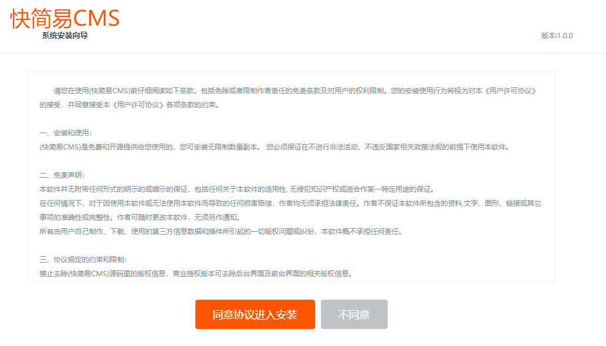
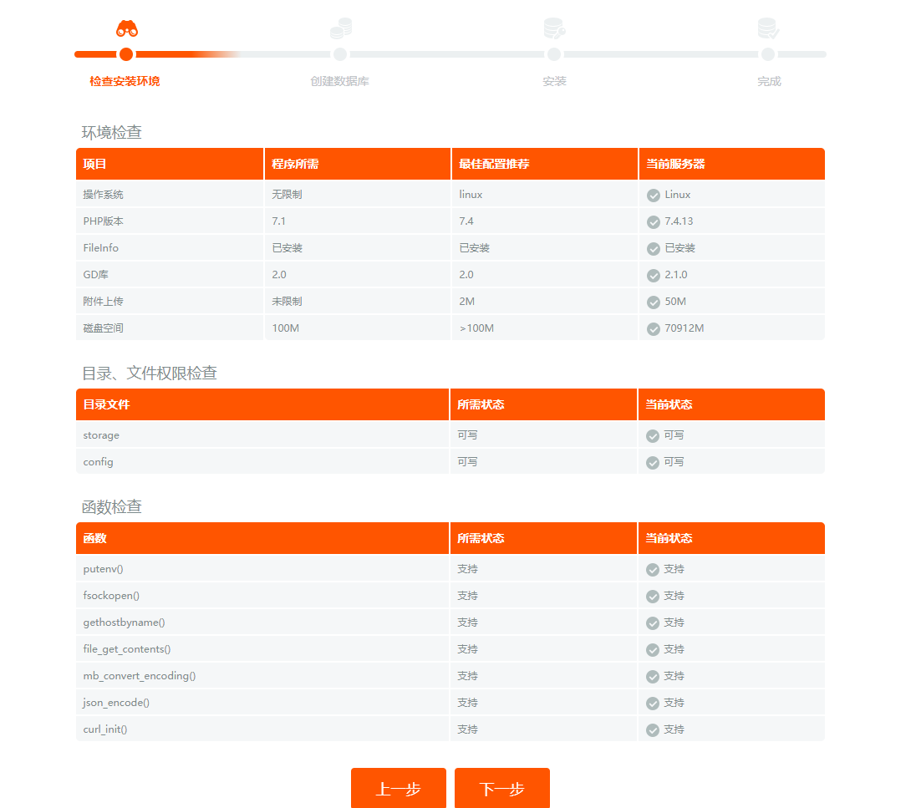
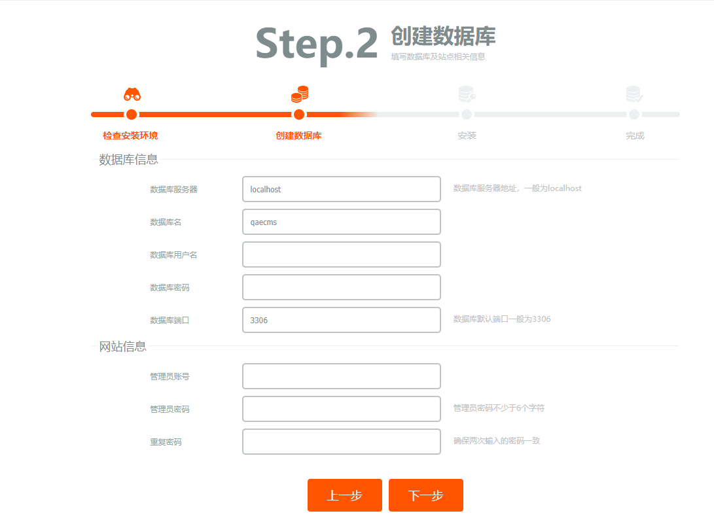
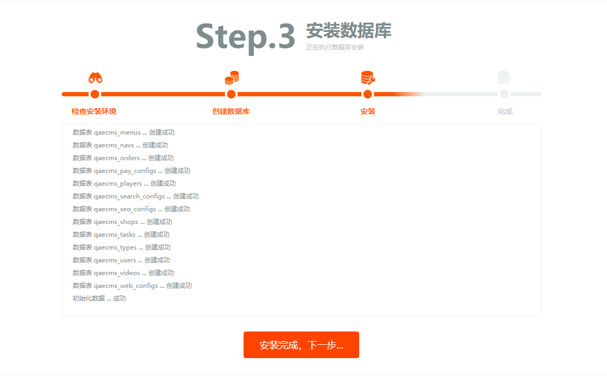
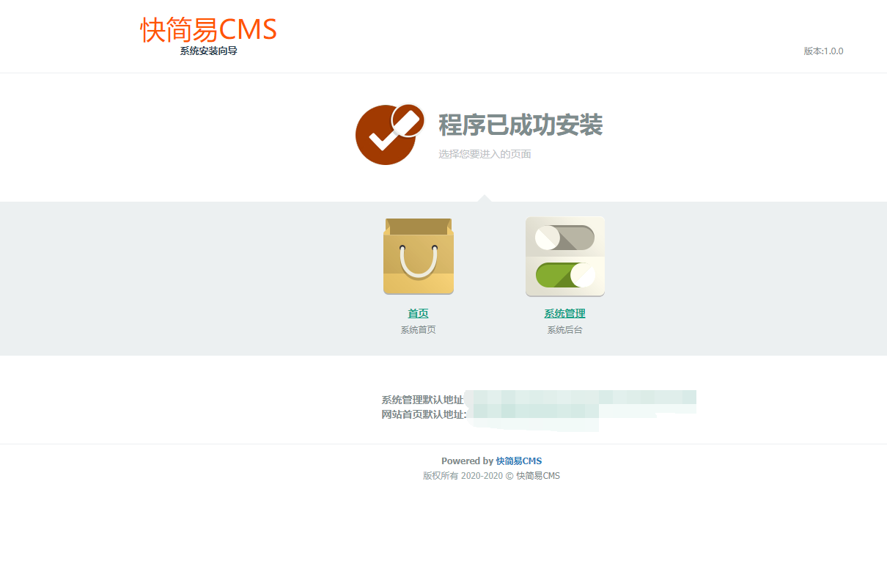
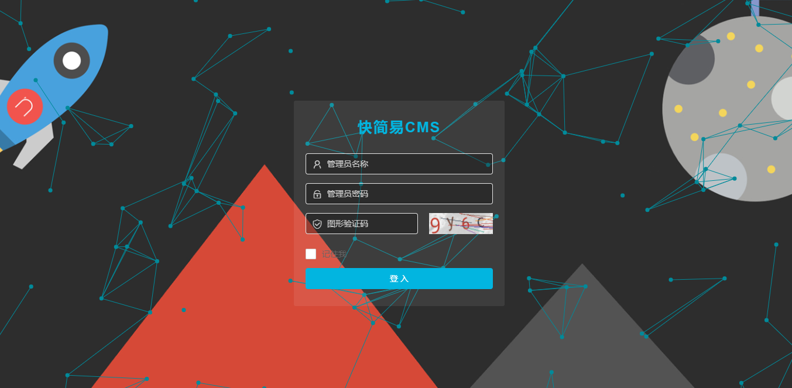
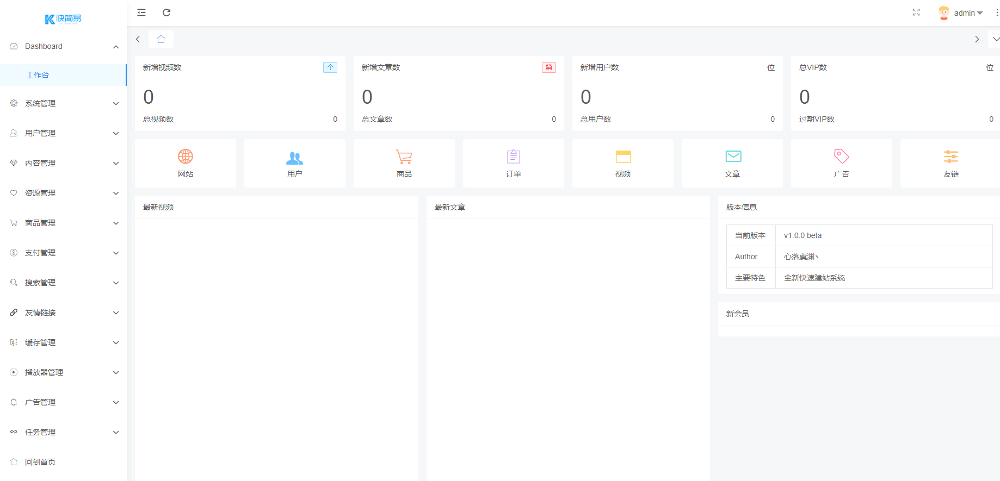

# 快速开始
> 以下内容皆基于宝塔面板讲解,其他环境请自行研究 谢谢

# 安装宝塔面板
[官方文档](https://www.bt.cn/bbs/thread-19376-1-1.html)
# 安装相关环境
>php7.4+nginx1.17+mysql5.7


# PHP配置
> 安装fileinfo扩展
>

> 设置超时时间
>

> 删除禁用函数(putenv)
>

> 重启php服务
# 建立站点

# 上传或者远程下载最新包到网站目录
> 地址:https://qaecms.lanzous.com/qaecms-lasted
# 网站设置
> 运行目录修改为public
>

> 伪静态
>
````
location = / {
    try_files /qaecms_page/pc__index__pc.html /index.php?$query_string;
}

location / {
    try_files $uri $uri/ /qaecms_page/$uri.html /qaecms_page/$uri.json /index.php?$query_string;
}
````


# 安装程序
> 访问域名将自动跳转到安装目录,按照安装程序填入相关信息一路下一步
>
 
 
 
 
 
> 访问默认地址进入管理后台 登录
>


> 恭喜你安装成功
